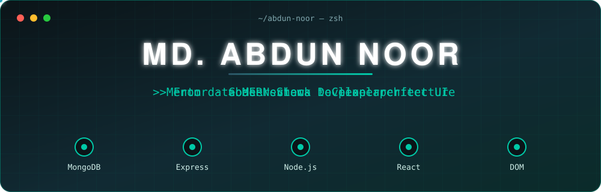
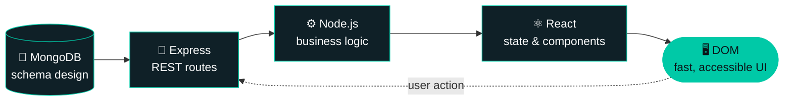

<div align="center">



<br/>

<a href="https://abdunnoor.vercel.app"></a>
<a href="https://www.linkedin.com/in/md-abdun-noor-22388b253/"></a>
<a href="mailto:abdunnoor2450@gmail.com"></a>


<br/><br/>

**`From database to DOM, I build the whole thing.`**

</div>

<br/>

```bash
$ whoami
abdun-noor — MERN Stack Developer · Mentor · Bangladesh 🇧🇩

$ cat focus.txt
Scalable full-stack apps & clean architecture

$ uptime --principles
performance · accessibility · readable code

$ status
● open to full-stack (MERN) roles, remote work & freelance
```

---

## ⚡ One request, end to end

I think in full request lifecycles, not isolated layers. Every feature I ship is designed across all five stops.



---

## 🧭 Profile

| | |
|---|---|
| **Role** | MERN Stack Developer |
| **Base** | Bangladesh 🇧🇩 |
| **Currently** | Deepening backend architecture & system design |
| **Leadership** | Mentor: code reviews, guiding fellow developers, turning business goals into engineering decisions |
| **Obsessions** | Performance · Accessibility (a11y) · Clean, scalable code |
| **Fun fact** | Chases 100/100 Lighthouse scores for fun 🚀 |
| **Ask me about** | `React` `Next.js` `Node.js` `MongoDB` `Tailwind CSS` |

---

## 🧰 Toolkit

<div align="center">

<table>
<tr>
<td align="center" width="33%"><b>Frontend</b><br/><br/>
</td>
<td align="center" width="33%"><b>Backend & Data</b><br/><br/>
</td>
<td align="center" width="33%"><b>Workflow</b><br/><br/>
</td>
</tr>
</table>

</div>

---

## 🛠️ Featured Work

<table>
<tr>
<td width="50%" valign="top">

### 🛒 Cartivo
*Next-gen eCommerce platform*

Conversion-optimized store with real-time state management, dynamic product filtering and a seamless cart lifecycle.

`React.js` · `Redux Toolkit` · `Tailwind CSS` · `REST APIs`

**[▶ Live demo](https://cartivo-pink.vercel.app/)**

</td>
<td width="50%" valign="top">

### 🌐 Engineer Portfolio
*Professional showcase site*

Statically generated, semantic and SEO-first, with 100/100 Lighthouse scores and zero layout shift.

`Next.js` · `TypeScript` · `Tailwind CSS` · `Vercel`

**[▶ Live demo](https://abdunnoor.vercel.app/)**

</td>
</tr>
</table>

<details>
<summary><b>🚧 In the lab: full MERN projects with live APIs and database-backed features</b></summary>

<br/>

More end-to-end MERN builds are on the way: real APIs, real schemas, real persistence. Watch this space.

</details>

---

## 📐 How I build

<details open>
<summary><b>Engineering principles</b></summary>

<br/>

- **Performance first:** Lighthouse is a design constraint, not an afterthought.
- **Accessible by default:** semantic HTML and a11y from the first commit.
- **Clean architecture:** code that scales and that teammates enjoy reading.
- **Mentorship:** code reviews that teach, and decisions tied back to business goals.

</details>

---

## 📊 GitHub pulse

<div align="center">


</div>

---

## 🤝 Let's build something

Open to **full-stack (MERN) roles**, **remote** opportunities and **freelance** projects.

```js
const reachOut = () => ({
  portfolio: "https://abdunnoor.vercel.app",
  linkedin:  "https://www.linkedin.com/in/md-abdun-noor-22388b253/",
  email:     "abdunnoor2450@gmail.com",
});
```

<div align="center">

<br/>


<br/><br/>

*"From database to DOM, I build the whole thing."*

</div>
